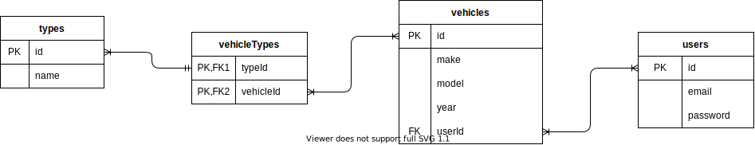

# Carzilla Search

## Description
----
Carzilla is the newest vehicle forum available. Using information from the National Highway Traffic Safety Administration (NTHSA), a user can find almost any vehicle imaginable and share their thoughts on them. If a user does not know exactly what vehicle they want to look up, the user can search based off multiple attributes such as vehicle type, make, model, and combinations of each. Users can then view associated comments for specific vehicles. 

If a user decides they want to save this information, they can sign up and create a profile. They will be able to save specific vehicles to their profile and be taken to the vehicle's detail page when selected. The user can also choose to delete saved vehicles from their profiles. If a user is logged in, their saved searches can easily be accessed. Once a user logs out, their saved searches are no longer available to them on the site.

## API Usage and Design Technology
------
Carzilla Search will use the Product Information Catalog Vehicle Listing (vPIC) from the NHTSA. The vPIC provides different methods to gather information provided from vehicle manufacturers. The application will use JSON data from the API to display vehicle information and provide search criteria. The application will be using search criteria to create queries to the API, get the json data, and display certain values to the user as either search parameters or vehicle information.

## Created using:
* HTML5
* PicoCSS Framework
    * Class and Class-less HTML
* Javascript
    * NodeJs
    * Express
    * EJS 
    * Axios
    * Sequelize
    * Bcrypt
    * Crypto-JS
* Heroku Deployment

There are no dependecies to install with this api. 

## Visit Carzilla Search:

<!-- link to site -->
[Carzilla Search](https://carzilla-search.herokuapp.com/)

## ERDs
-------

### users table:
| id      | email | password |
| ----------- | ----------- | ----------|
| integer      | string | string |

### vehicles table:
| id | make | model | url | userId |
| --- | --- | ---| ---| ---|
| integer      | string | string | string | integer|

### comments
|id | email | content | url | userId | vehicleId |
|---|---|---|----|----|----|
|integer|string|text|string|integer|integer|

One user can have many saved vehicles - 1:M relation
One user can have many comments - 1:M relation

Many vehicles can belong to many users - N:M relation
Many comments can belong to many vehicles - N:M relation

## RESTful Routing
------------------
| Verb | Path | Action | Description |
| --- | --- | ---| ----|
| Get | / | index | show a vehicle search form |
| Get | /search | show | display list search result of vehicles |
| Get | /search/:id | show | display individual vehicle |
| Put | /search/:id | update | update users profile with a saved vehicle id |
| Get | /signup | show | display a sign up form |
| Post | /signup | create | creates a new user |
| Get | /login | show | display a login form |
| Put | /login | update | update cookies to authorize user |
| Get | /profile | show | show user profile |
| Delete | /profile | destroy | remove a saved vehicle from user's profile |
| Delete | /profile | destroy | remove a comment from user's profile |

## Original Wireframes
----
### Signup

### Login

## Search

----

## Reflection
* Still need to manage time better
    * Somehow get stuck on little things for a long time, but big problems solved rather quickly
* Learned how to layout routes better when extracting information that may be null at times.
    * Used conditionals to make data accesible

* Want to create pages as partials
* Want to automatically delete a comment if saved search is deleted from profile
---
## Goals
### MVP
* A search page that uses API data 
* A specific vehicle page, with a button to faavorite
* The button will redirect to a sign up or login page 
* A login page
* A sign up page
* A profile page with saaved vehicles
* Ability to delete vehicles from profile

### Stretch
* Use drop downs for searching
* Have some info on the saved vehicle in the profile page, instead of having to go to specific vehicle page

---
# Sources Used

Various https://w3schools.com and https://developer.mozilla.org/ guides and refernces were used for javascript functionality.

[Sequelize](https://sequelize.org/docs/v6/getting-started/) documentation used for association of models and routing functions.
