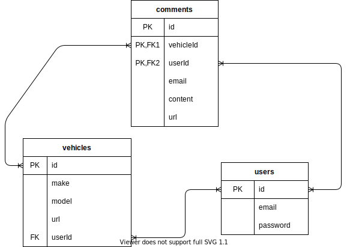

# Carzilla Search

## Description
----
Carzilla is the newest vehicle information search tool available. Using information from the National Highway Traffic Safety Administration (NTHSA), a user can find technical information on vehicles and the definitions for these technologies. If user does not know exactly what vehicle they want to look up, the user can search based off multiple attributes such as vehicle type, make, model, year, and combinations of each. Users can then view associated information for specific vehicles. 

If a user decides they want to save this information, they can sign up and create a profile. They will be able to save specific vehicles to their profile and be taken to the vehicle's detail page when selected. The user can also choose to delete saved vehicles from their profiles. If a user is logged, their saved searches can easily be accessed. Once a user logs out, their saved searches are no longer available to them on the site.

## API Usage
------
Carzilla Search will use the Product Information Catalog Vehicle Listing (vPIC) from the NHTSA. The vPIC provides different methods to gather information provided from vehicle manufacturers. The application will use JSON data from the API to display vehicle information and provide search criteria.  

The application will using search criteria to create queries to the API, get the json data, and display certain values to the user as either search parameters or vehicle information.

## ERDs
-------

### users table:
| id      | email | password |
| ----------- | ----------- | ----------|
| integer      | string | string |

### vehicles table:
| id | make | model | year |
| --- | --- | ---| ----|
| integer      | string | string | date/integer |

### types
|id | name |
|---|---|
|integer|string|

One user can have many saved vehicles - 1:M relation

Many vehicles can belong to many users - N:M relation

Users have no relation to the vehicle types, so we join them with **vehicleTypes table:**
|id | vehicleId | typeId |
|---|---|---|
|integer|integer|integer|

## RESTful Routing
------------------
| Verb | Path | Action | Description |
| --- | --- | ---| ----|
| Get | / | index | show a vehicle search form |
| Get | /search | show | display list search result of vehicles |
| Get | /search/:id | show | display individual vehicle |
| Put | /search/:id | update | update users profile with a saved vehicle id |
| Get | /signup | show | display a sign up form |
| Post | /signup | create | creates a new user |
| Get | /login | show | display a login form |
| Put | /login | update | update cookies to authorize user |
| Get | /profile | show | show user profile |
| Delete | /profile | destroy | remove a saved vehicle from user's profile |

## Wireframes
----
### Signup

### Login

## Search

----

## User Stories
* As a user, I want to be able to search vehicles by different methods in case I don't know exactly what vehicle I am looking for.
* As a user, I want to be able to see a detail page of a specific vehicle to get information on that vehicle.
* As a user, I want to be able to save vehicles to a profile.
* As a user, I want to be able to create a profile to manage my saved vehicles.
* As a user, I want to be able to remove vehicles from my search. 
---
## Goals
### MVP
* A search page that uses API data 
* A specific vehicle page, with a button to faavorite
* The button will redirect to a sign up or login page 
* A login page
* A sign up page
* A profile page with saaved vehicles
* Ability to delete vehicles from profile

### Stretch
* Use drop downs for searching
* Have some info on the saved vehicle in the profile page, instead of having to go to specific vehicle page
